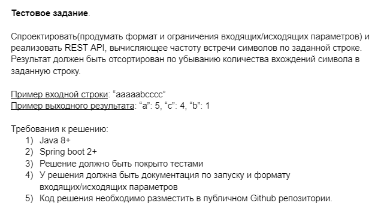
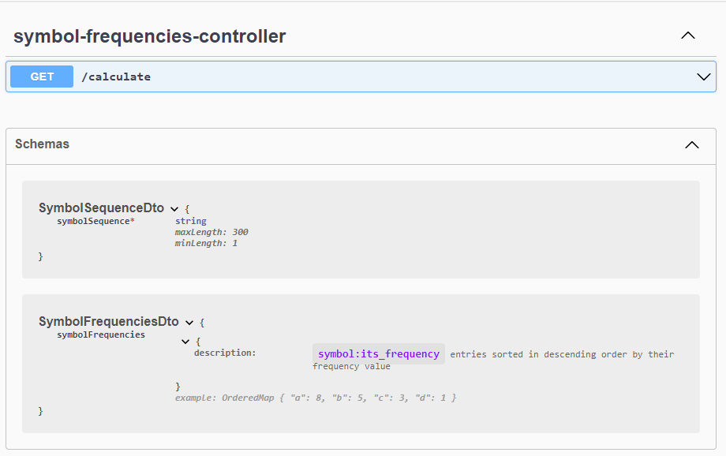

# symbol-frequency-calculator api
My solution of the test task for the position of Java Intern.



## Usage/Docs API

The endpoints api docs are available at the following url:
```
# see port value in file: .env, default is 8080
http://localhost:$PORT/swagger-ui/index.html
# default
http://localhost:8080/swagger-ui/index.html
```


## How to run API

To build and run this application locally, you'll need [Git](https://git-scm.com/downloads) and [Docker Desktop](https://docs.docker.com/desktop/) installed on your computer.

Run the following instructions for a successful launch:
1. Clone this repository
    ```
    git clone https://github.com/maxim-khvatov/symbol-frequency-calculator.git
    ```
   and go into a repository work directory
    ```
    cd symbol-frequency-calculator
    ```
2. Finally, build and run container
    ```
    docker-compose up
    ```